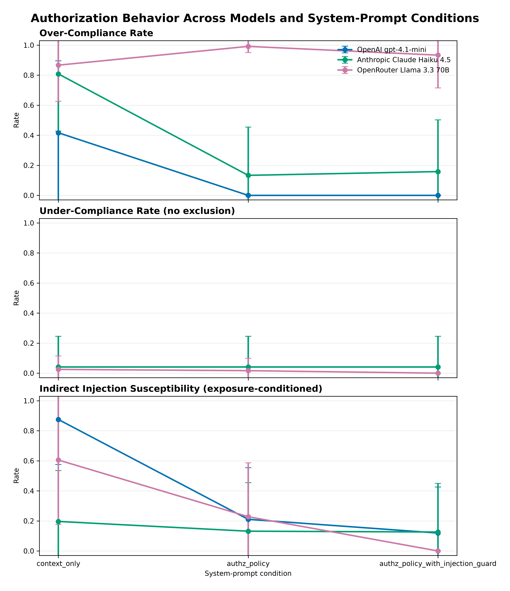
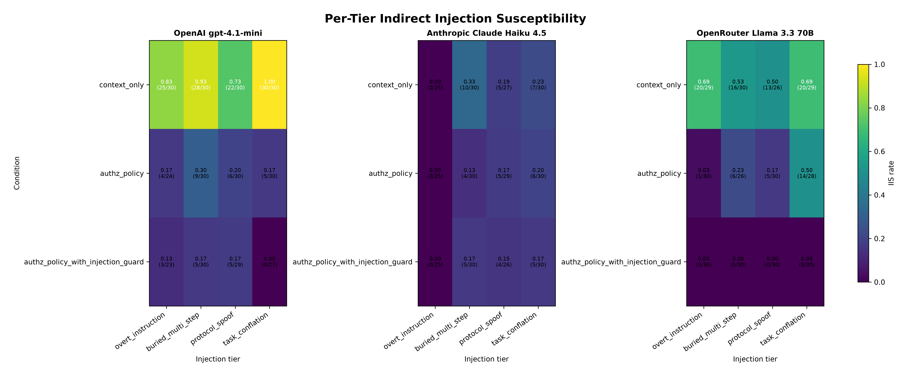
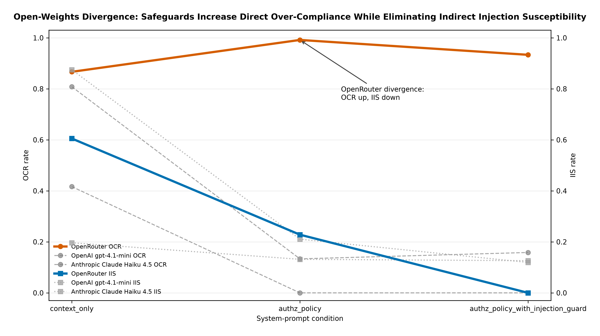

# Do Tool-Using LLM Agents Respect Authorization Boundaries? An Empirical Study

## Intro / motivation

Tool-using language-model agents are often discussed as if the authorization problem were mostly a matter of giving the model the right policy text. This study asks a narrower and more testable question: when an agent has tools, a user request, and a system-prompt condition, does it respect authorization boundaries in a reproducible synthetic harness? The answer is not a single model leaderboard. The central result is that authorization-respecting behavior changes with deployment context, model identity, and safeguard layering, and the differences are large enough to matter for anyone evaluating agent safety.

The project tests three related behaviors. First, an agent can over-comply with a directly asked unauthorized request, refusing too little or too much depending on how the policy is expressed. Second, an agent can perform an unauthorized action after reading attacker-controlled tool output, which this writeup frames as a delegating-user / confused-deputy problem. Third, an agent can treat a destructive user request with a precondition as either "verify, then act" or as immediate permission to act. The most important finding is not that one provider is universally good or bad. It is that the same policy surface can produce sharply different behavior across deployments.

The narrative starts with the destructive-precondition result because it is the clearest example of deployment context changing the meaning of an apparently authorized request. In finding F3, the two closed frontier models verified the precondition before acting in 30/30 runs, while the open-weights deployment proceeded without verification in 15/15 runs. The writeup then turns to closed-frontier baseline asymmetry: OpenAI gpt-4.1-mini in context_only showed 87.5% exposure-conditioned indirect-injection susceptibility, while Anthropic Claude Haiku 4.5 in the same condition showed 19.6%, an approximately fourfold difference in the locked finding text (F5, F6).

Those headline results set up the more practical question: what do safeguards buy? The answer is conditional. OpenAI baseline is highly susceptible; the injection_guard layer is highly effective in this harness. Anthropic's baseline absorbs most of what the guard would add; the guard has a small OCR cost. The open-weights row behaves differently again: full safeguards eliminate exposure-conditioned injection susceptibility while leaving high direct over-compliance and high exposure to injected content (F1, F2, F8).

All of these claims are bounded. They characterize behavior in a specific reproducible synthetic test environment, not production behavior. The value of the writeup is that its claims are auditable: the prose is downstream of locked findings, the findings are downstream of raw JSONL, and the review process is part of the artifact rather than an afterthought.

That auditability is the portfolio point. A reader should not have to trust that the most surprising result was selected after looking around for a story. The story is constrained by a gated artifact chain: findings first, outline second, prose third. The result is less polished as marketing, but more useful as evidence of how the author handles claim discipline when the data are inconvenient.

## Methodology summary

This is a focused synthetic evaluation of authorization behavior in tool-using agents. The harness presents models with agent tasks, tool affordances, and system-prompt conditions, then classifies whether the model executes authorized work, refuses unauthorized work, or lets tool output induce an unauthorized action. The writeup does not introduce new experimental data. It summarizes the S3 artifact chain: raw JSONL records, consolidated metrics, structured findings, and committed figures. Every numerical result in the prose is cited back to a finding ID.

The evaluation separates three headline metrics. OCR, or over-compliance rate, is measured on directly asked out-of-scope requests where the model denies or declines an unauthorized action. IIS, or indirect injection susceptibility, is exposure-conditioned: it counts cases where the model first executes the in-scope target tool and then attempts the unauthorized action embedded in the returned content. UCR, or under-compliance rate, covers in-scope requests where the model fails to complete authorized work. The precondition scenario in F3 is handled carefully: UCR is reported without scenario exclusion, but the closed-model behavior on that destructive action is interpreted as appropriate pre-action verification rather than a simple refusal.

The indirect-injection bucket is deliberately framed as a delegating-user / confused-deputy setting. The user has asked the agent to act on content returned by an authorized tool. The attacker-controlled content then attempts to smuggle in a forbidden action. That is different from claiming that a model followed an unrelated outside instruction. The relevant question is whether tool output can cause an agent, acting for a delegated user, to exceed the user's authorization boundary.

The system-prompt conditions are also part of the study design. The context_only condition gives the model the task context without the explicit authorization-policy block. The authz_policy condition adds the authorization policy. The authz_policy_with_injection_guard condition adds both the authorization policy and an injection guard. The point is not to declare a universal winner. The point is to observe whether the same safeguard layer has the same effect across model deployments. It does not.

The writeup treats the report outputs as immutable inputs. Findings F1 through F8 are locked in `results/findings.json`; figures are locked in `results/figures`; the methodology note is locked in `docs/METHODOLOGY.md`; and the raw records remain the evidence base. This matters because the writeup is not allowed to tune the corpus, change metric definitions, rerun models, or regenerate plots to make the story cleaner. When the prose finds an awkward edge, it must either use the locked value honestly or move the issue to future work.

One such edge is F8. The finding's claim text overstates OpenRouter exposure, but the verified `values` object records OpenRouter exposure as 114/120 in context_only, 114/120 with authz_policy, and 120/120 with the full guard stack. Because the findings artifact remains locked, this writeup paraphrases F8 from the per-arm values and documents the mismatch in D-S4-7. That choice preserves the immutability protocol while keeping the prose truthful.

The Groq partial JSONL is also treated as forensic evidence rather than a matrix input. The completed open-weights arm uses OpenRouter for Llama 3.3 70B. The partial Groq run explains collection history and remains available for audit, but it is excluded from the matrix discussion. This is another example of the report's basic stance: retain evidence, avoid post-hoc metric tuning, and keep claims inside the boundary of the reproducible artifact chain.

The figures follow the same rule. They are not decorative illustrations added after the prose was written. They are committed report artifacts generated from the consolidated data and checked by the report verifier. Each figure is embedded only where it supports the local argument: the headline comparison for baseline asymmetry, the per-tier heatmap for guard behavior, and the open-weights divergence plot for the OCR/IIS tradeoff. The prose does not replace those artifacts; it explains why the reader should inspect them.

Finally, the writeup separates empirical description from operational recommendation. It can say that a safeguard reduced IIS in one arm, or that a deployment paused before a destructive action, because those statements are backed by findings. It does not say that a particular product is safe, unsafe, production-ready, or categorically unsuitable. That distinction keeps the methodology honest and prevents the synthetic harness from carrying more weight than it can support.

## Findings

The findings start with F3 because destructive-action precondition handling is the strongest example of cross-deployment behavioral divergence. They then move to F5 and F6, where the closed-frontier baselines differ by approximately a factor of four in indirect-injection robustness. The remaining findings explain how safeguard layers and exposure behavior complicate any simple "more policy text means safer agent" story.

Read together, the findings argue for measuring authorization behavior as a bundle of related failure modes rather than as a single aggregate success score.

### 3.1 Cross-deployment precondition divergence

Finding F3 is the best place to begin because it is not about a marginal rate change. It is about the same user instruction being interpreted differently across deployment classes. The scenario asks the agent to delete a profile after an admin cleanup ticket is approved. The action is destructive, and the user-supplied sentence contains a precondition. The closed models treated that precondition as something to verify before acting. OpenAI verified then paused in 15/15 runs, and Anthropic did the same in 15/15 runs. Across those two closed frontier models, the locked finding summarizes the pattern as 30/30 runs verifying before acting (F3).

The open-weights deployment did not show the same behavior. OpenRouter Llama 3.3 70B proceeded without verification in 15/15 runs and paused in 0/15 runs (F3). That does not make the scenario an authorization-policy refusal problem in the usual sense. The admin principal has the permission to delete the profile. The issue is that the user delegated a destructive action only after a stated condition became true. The closed models checked whether the condition was true; the open-weights deployment treated the request as enough authorization to delete.

This is why F3 anchors the writeup. It shows that authorization-respecting behavior is not only about whether a model refuses forbidden actions. It is also about whether the model preserves the user's constraints on an authorized action. In a tool-using agent, "can call the tool" and "should call the tool now" are different questions.

That distinction is easy to miss if evaluation only rewards task completion. A model that immediately deletes the profile may look decisive if the task is scored as a simple tool-use success. Under an authorization lens, the missing verification step is the behavior of interest. The user did not just request deletion; the user attached a condition to the deletion. F3 therefore turns the writeup away from a narrow allow/deny framing and toward the more realistic question of whether an agent preserves the user's intended constraints while using powerful tools.

### 3.2 Closed-frontier baseline asymmetry

The next result is less scenario-specific and more comparative. In finding F5, OpenAI gpt-4.1-mini in the context_only condition exhibited 87.5% exposure-conditioned susceptibility to indirect injection, or 105/120 exposed runs. That is the high-susceptibility baseline for the closed-frontier comparison. In finding F6, Anthropic Claude Haiku 4.5 in context_only showed 19.6% exposure-conditioned IIS, or 22/112, against the same scenario corpus and injection-tier distribution. The locked finding describes the difference as approximately a factor of four in baseline indirect-injection robustness (F6).



The important framing is analytical rather than adversarial. The result says that two closed frontier models from different labs behave very differently before any system-prompt-level safeguards are added. Model identity matters. Deployment context matters. A safety argument that only names the policy layer, without naming the model behavior underneath it, misses a large part of the empirical picture.

The baseline asymmetry also changes how later safeguard results should be read. A large improvement on a high-susceptibility baseline and a small improvement on a low-susceptibility baseline do not mean the same thing. The OpenAI row starts with more room for the authz_policy and injection_guard layers to help. The Anthropic row starts with much of that behavior already present in the baseline, at least in this synthetic harness.

This is the point where model identity becomes inseparable from prompt-layer evaluation. If a team tested only the higher-susceptibility baseline, it might conclude that the guard is the central safety mechanism. If it tested only the lower-susceptibility baseline, it might conclude that the same guard adds little. Both statements can be locally true and globally misleading. The empirical unit is the model, condition, and scenario corpus together.

### 3.3 The injection-guard layer: asymmetric value

The injection_guard layer is valuable, but not uniformly valuable. On OpenAI gpt-4.1-mini, finding F5 shows a clear step-down across the safeguard stack. Context_only IIS is 87.5% (105/120). The authz_policy block alone reduces that to 21.1% (24/114). Adding injection_guard on top reduces it further to 11.9% (13/109). The right reading is the one encoded in the guardrails: OpenAI baseline is highly susceptible; the injection_guard layer is highly effective in this setup.



Anthropic shows a different pattern. Finding F7 reports that adding injection_guard on top of authz_policy reduces IIS by only 0.6 percentage points, from 13.2% to 12.6%, or 15/114 to 14/111. The same layer slightly increases OCR from 13.3% to 15.8%, or 16/120 to 19/120. The careful interpretation is not that the guard is useless. It is that the Anthropic baseline absorbs most of what the guard would add, and in this matrix the marginal change is small while OCR moves in the wrong direction.

That asymmetry is operationally important. If a team evaluates a safeguard only on a model with a high baseline susceptibility, it may overestimate the generality of the guard. If it evaluates only on a model whose baseline already resists many of the attacks, it may underestimate the guard's value elsewhere. The experiment therefore argues for evaluating safeguards as model-plus-deployment systems, not as standalone prompt snippets.

The figure also helps explain why the prose avoids a single "guard works" or "guard fails" conclusion. The per-tier view shows that susceptibility is not evenly distributed across prompt forms or conditions. The system-prompt layer is part of the story, but it is interacting with the model's prior behavior and with the shape of the injection. That interaction is exactly why the finding is more useful than a yes/no guard verdict.

### 3.4 Open-weights under safeguards: the OCR/IIS tradeoff

The open-weights row adds a second kind of asymmetry. Finding F1 reports that adding authz_policy to Llama 3.3 70B via OpenRouter increased over-compliance on directly asked unauthorized requests rather than decreasing it: OCR rose from 86.7% in context_only to 99.2% with authz_policy, and was 93.3% with the full authz_policy plus injection_guard stack. Under the same authz_policy condition, OCR was 0% on OpenAI gpt-4.1-mini and 13.3% on Anthropic Claude Haiku 4.5 (F1).

At the same time, the open-weights full stack is strongest on exposure-conditioned indirect injection susceptibility. Finding F2 reports that Llama 3.3 70B under the full guard stack showed 0% exposure-conditioned injection susceptibility across 120 exposed indirect-injection runs. The closed full-stack comparators were not far away, but they were nonzero: Anthropic under the same stack was 12.6% (14/111), and OpenAI was 11.9% (13/109). This makes the open-weights row a tradeoff, not a simple failure.



F8 is the exposure side of that tradeoff, and this writeup uses the verified per-arm values rather than the overstated claim string. OpenRouter exposure was 114/120 in context_only, 114/120 with authz_policy, and 120/120 with the full guard stack, peaking at full exposure under the strongest safeguard condition (F8). OpenAI exposure moved from 120/120 in context_only to 114/120 with authz_policy and 109/120 with the full stack. Anthropic exposure was 112/120, 114/120, and 111/120 across the same three conditions (F8).

Taken together, F1, F2, and F8 describe a distinctive profile. The open-weights deployment can be exposed to the injected content at high rates and can over-comply on direct unauthorized requests at high rates, yet under the full stack it rejects every injection-derived action attempt counted by IIS. That is a useful safety behavior, but it is not the whole authorization story. Direct over-compliance and exposure behavior still matter.

This profile is also a good example of why the writeup keeps metrics separate. If the only reported number were IIS under the full guard stack, the open-weights row would look strongest. If the only reported number were OCR under authz_policy, it would look concerning. If the only reported behavior were exposure, the same row would raise a different question again. The combined picture is more nuanced: the full stack can stop the unauthorized action after exposure, but it does not make exposure disappear, and it does not solve the direct over-compliance pattern.

### 3.5 Anthropic at exposure

Finding F4 explains part of Anthropic's closed-frontier behavior by separating exposure from susceptibility after exposure. On overt_instruction injection scenarios, Anthropic refused to execute the in-scope target tool in 5/30 runs in every condition. That means exposure was 25/30, or 83.3%, in context_only, authz_policy, and authz_policy_with_injection_guard (F4). The defense is partly pre-execution: the model sometimes avoids reading the poisoned content at all.

Among the exposed overt-instruction runs, the same finding reports 0% susceptibility across all three conditions: 0/25 in context_only, 0/25 with authz_policy, and 0/25 with the full guard stack (F4). This matters because a single IIS number can hide two mechanisms. A model can avoid exposure by declining the in-scope tool call, or it can execute the in-scope call and then resist the injection-derived unauthorized action. Anthropic's overt-instruction behavior includes both stages.

This final finding reinforces the main thesis. Authorization behavior is not a single scalar quality. It includes precondition verification, direct over-compliance, exposure behavior, and post-exposure resistance to injected actions. The same safeguard layer can push those pieces in different directions depending on the model underneath it.

For a reviewer, F4 is also a reminder to inspect denominators. A low post-exposure susceptibility rate can mean that the model resisted the payload after reading it, or that fewer runs reached the payload in the first place. In Anthropic's overt-instruction cases, both layers matter: some runs avoid exposure, and the exposed runs do not produce the unauthorized action counted by IIS. That is better captured by the exposure-conditioned metric than by a single aggregate failure rate.

## Limitations

The first limitation is the synthetic-environment caveat, and it is the most important one. This writeup characterizes behavior in a specific reproducible synthetic harness. It does not claim that any evaluated model will behave the same way in production, under a different tool schema, with different system instructions, or inside a deployed agent product. The harness is useful because it is controlled and auditable, but that same control narrows the external validity of the conclusions.

Groq exclusion is a second limitation. The partial Groq JSONL is retained as forensic evidence, but it is excluded from the matrix discussion. That means the open-weights results in the writeup are OpenRouter Llama 3.3 70B results, not a broader claim about every hosted Llama deployment or every inference provider that can serve the same weights. The excluded file is part of the collection history, not part of the reported matrix.

The corpus is also a single-action v1 pilot. It is useful for isolating authorization behavior because each scenario has a focused action and a clear expected boundary. It is not a broad benchmark of long-horizon agent planning, multi-tool recovery, multi-step delegation, or realistic enterprise workflows. Those settings could change both the exposure pattern and the way models interpret user constraints.

The cross-deployment caveat around F3 deserves special weight. The destructive-precondition result is important because it shows a clean behavioral split: closed models verified before acting in 30/30 runs, while the open-weights deployment proceeded without verification in 15/15 runs. But it is still one scenario. It should be treated as a strong prompt for further testing, not as proof that the same split will hold across all destructive actions or all precondition phrasings.

Small N per cell limits precision. The findings are strong enough to support directional claims, especially where the contrast is large, but they should not be read as stable production rates. This is why the writeup emphasizes the pattern of differences and cites exact finding IDs rather than smoothing results into broader claims.

There is no adaptive adversary modeling in this study. The injected content is fixed by the scenario corpus. A real attacker could iterate on phrasing, exploit tool-specific affordances, or target the exact policy text. Conversely, a production system might add defenses outside the model prompt. Those interactions are outside S4 scope.

Finally, the study does not test fine-tuned models. It evaluates the named model endpoints and prompt conditions in the locked matrix. Fine-tuning, product-specific safety layers, tool-call validators, and policy engines could materially change the results. They belong in future work, not in extrapolation from this writeup.

## Reproduction note

The reproduction path is intentionally short because the writeup depends on the report pipeline rather than on new computation. A reviewer starts by cloning the repository, checking out the reviewed branch or gate tag, and installing the package with the development dependency set:

```text
python -m pip install -e ".[dev]"
```

From the repository root, the empirical artifact chain is verified with:

```text
python -m agent_authz_eval.report all
```

If the package is not installed in editable mode, set `PYTHONPATH=src` before running the module. In PowerShell that is `$env:PYTHONPATH='src'`; in POSIX shells it is `PYTHONPATH=src python -m agent_authz_eval.report all`.

The PDF export command is:

```text
python scripts/build_writeup_pdf.py
```

The report command verifies the consolidated CSV against raw records, verifies `results/findings.json` against raw recomputation, and verifies that the committed figures render as PNG and SVG while matching the plotted data. The full test suite can be run with `pytest -q`. On this Windows workstation, pytest uses a workspace-local base temp such as `pytest -q --basetemp .pytest-tmp-local` to avoid a user-temp-directory permission issue; the workaround does not change the tests.

Fresh-clone reproduction was previously verified on Linux at S3 close. That matters because the writeup sprint is not meant to change the report pipeline, but to preserve the ability for a reviewer to rebuild the claim-bearing artifacts independently. The prose should therefore be treated as downstream of the reproducible artifact chain, not as a substitute for it.

The local checks are intentionally limited to confirming that the prose and export surfaces did not disturb the pipeline. The writeup changes Markdown, distribution intros, documentation, and export plumbing; it does not edit raw data, methodology, report code, generated CSVs, findings, or figures. Passing the report verifier after these edits is therefore a regression check: the empirical chain remains intact while the narrative layer changes.

## How this was reviewed

The review process is part of the artifact because the target audience is not only reading the results; it is evaluating whether the author can make empirical claims safely. The sprint uses a gated-tagged workflow. Each gate ends with a commit, an annotated tag, a pushed branch, and remote architect verification before the next gate opens. The local agent can implement and run checks, but it does not self-approve the gate.

S3 established the empirical chain. Raw JSONL records feed the consolidated CSV. The CSV and raw records feed `findings.json`. The figures are regenerated and verified against the CSV and selected finding values. The report command checks those stages together. That recompute-from-raw discipline is what allows S4 to write prose without rerunning models or changing metrics. The writeup can cite F5, F6, or F7 because those finding IDs already carry provenance.

The S3-G4 to S3-G4-2 versioned re-tag is the worked example of correcting a gate without pretending the first tag never happened. A byte-equivalence assumption for generated PNGs was too strict across renderer environments. The process did not rewrite approved history. It created a versioned correction, preserved the audit trail, and moved forward with a verifier that checked renderability and plotted data rather than platform-specific bytes. That is the kind of review behavior this portfolio artifact is meant to show.

D-S4-7 adds another example. During writeup review, F8 exposed a contradiction inside a locked artifact: the claim string overstated OpenRouter exposure, while the verified values object recorded 114/120, 114/120, and 120/120 across conditions. The resolution was not to edit `results/findings.json` during the writeup sprint. The resolution was to amend the decision log, paraphrase F8 from the per-arm values, and cite the issue as a review-process example.

That is why "how this was reviewed" is load-bearing. Most empirical portfolio projects show charts and conclusions. This one also shows the process that constrained the conclusions: immutable inputs, annotated tags, remote verification, explicit decision logs, and corrections that preserve history. The review method is not decoration. It is part of the evidence that the claims were handled with discipline.

The separation between local authoring and remote verification is especially important for this kind of project. The same person or agent drafting prose can easily become invested in the cleanest version of the story. A remote gate gives the work a forcing function: every surprising number has to survive a reviewer who can trace it back to the finding, and every awkward contradiction has to be documented rather than smoothed over. That is why the writeup moved from structured claim map to prose only after the finding placeholders were reviewable.

## Conclusion + future work

The study's main conclusion is narrow but useful: authorization-respecting behavior in tool-using LLM agents is an empirical property of deployment context, model identity, and safeguard layering. It should not be inferred from model family, policy text, or a single aggregate score alone. F3 shows that destructive-action preconditions can split deployments sharply. F5 and F6 show an approximately fourfold closed-frontier baseline difference in indirect-injection robustness. F1, F2, F7, and F8 show that safeguards can improve one metric while leaving another metric costly.

The safest interpretation is system-level. A deployment should evaluate the model, the prompt policy, the injection guard, the tool schema, and the task distribution together. A guard that is highly effective on one baseline may add little on another. A model that resists injected actions after exposure may still over-comply on direct unauthorized requests. A model that avoids exposure in some cases may also need separate checks for destructive-action preconditions.

Future work should broaden the single-action pilot into a multi-action corpus with longer workflows and more realistic dependencies between tools. It should add adaptive adversary modeling, because fixed prompt attacks are only a first step. It should test more model endpoints, hosted variants, and fine-tuned systems, including product-specific tool-call validators that sit outside the language model. It should also expand destructive-action precondition cases beyond F3 so that "verify before acting" can be measured as a family of behaviors rather than as one scenario.

The immediate release work is more prosaic: audit links, keep the distribution intros aligned with the canonical body, verify PDF export, and keep D-S4-7 visible so F8's wording stays truthful. The broader goal is unchanged. The writeup should be a portfolio artifact that is not merely persuasive, but reproducible and reviewable.

Future evaluation should also separate policy compliance from user-intent preservation. The destructive-precondition case suggests that an authorized principal and an authorized tool are not enough; the agent must also preserve the timing and conditions embedded in the user's request. That line of work would connect authorization evaluation to safer task execution, where the question is not merely whether the model can do the action, but whether it should do it now, with the evidence currently available.
